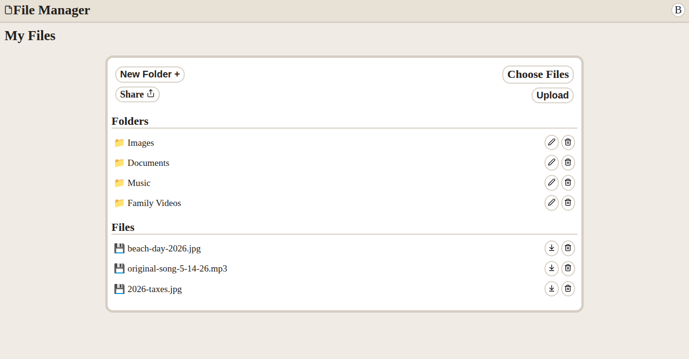

# File Manager

**Live Preview:**

A full-stack file manager application where users can upload files and organize them into folders. Users can also share their folders with others, regardless of whether they have an account.



## Features

### Folders

- Users can create folders to organize their files.
- Folders can be freely navigated with built-in breadcrumb navigation.

### Files

- Users can upload files to their folders.
- Uploaded files can be downloaded or deleted.
- Users can view file information, such as file size and upload time.

### Share

- Users can share their chosen folders with anyone, whether they are logged in or not.
- Actions available to shared users differ from those available to the owner, such as preventing shared users from deleting or renaming files and folders.
- Shared users can only view files and folders contained within the shared folder.

## Technologies Used

### Frontend

- HTML
- CSS
- JavaScript
- EJS

### Backend

- Node.js
- Passport.js
- Express
- Express-session
- Express-validator
- Prisma
- PostgreSQL

## Prerequisites

- Node.js
- npm
- PostgreSQL

## Installation

1. Clone the repository

```bash
git clone https://github.com/Salypse/file-uploader.git
```

2. Install dependencies

```bash
npm install
```

3. Create a .env file with the following variables

```bash
touch .env
```

```env
# .env

PORT=desired_port_number
CONNECTION_STRING=postgresql_db_connection_string
SESSION_SECRET=your_random_session_secret
SUPABASE_URL=supabase_db_connection_string
SUPABASE_SECRET_KEY=supabase_secret_key
```

4. Create database tables

```bash
npx prisma migrate dev
```

5. Start the application

```bash
npm run start
```
